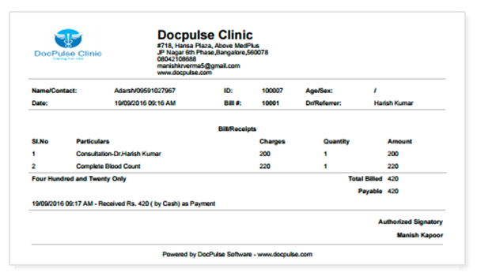

# AI-Powered Amount Detection in Medical Documents

**Demo Video Link:** [Link](https://drive.google.com/file/d/1p54qc8BZRJKKfnxrTssmX1CkQ9vY5nTw/view?usp=sharing)

**Google drive Link:** [Link](https://drive.google.com/drive/u/1/folders/12d90aM-Ps-6QFfSC_UupxHyFSlByxwrC)

## Overview

This project provides an AI-powered solution for extracting and analyzing amounts from medical documents using OCR and advanced text processing techniques.

## Features

- 🏥 Medical bill OCR processing with bounding boxes
- 📝 Direct text input processing  
- 🤖 AI-powered amount extraction and classification
- 🎨 Beautiful, responsive frontend interface
- 📊 Structured data display with confidence scores
- 🔄 Real-time processing status updates

## Project Structure

- `frontend/` - React-based web interface
- `backend/` - Node.js API server with OCR and AI integration
- `models/` - AI model configurations and data
- `postman-collection.json` - API testing collection

## Quick Start

1. **Clone the Repository:**
   ```bash
   git clone https://github.com/Charish53/plum.git
   cd plum
   ```

2. **Backend Setup:**
   ```bash
   cd backend
   npm install
   ```

3. **Environment Configuration:**
   Create a `.env` file in the backend directory:
   ```bash
   # Create .env file
   touch .env
   ```
   
   Add the following environment variables to `.env`:
   ```env
   # Google Gemini API Key (optional - system will use regex fallback if not provided)
   GEMINI_API_KEY=your_gemini_api_key_here
   
   # Server Configuration
   PORT=3002
   
   # CORS Configuration
   CORS_ORIGIN=http://localhost:3000
   
   # File Upload Configuration
   MAX_FILE_SIZE=10MB
   ALLOWED_FILE_TYPES=jpg,jpeg,png,pdf
   
   # Optional: Enable debug logging
   DEBUG=true
   ```
   

4. **Start the Backend Server:**
   ```bash
   npm run dev
   ```

5. **Frontend Setup:**
   ```bash
   cd frontend
   npm start
   ```

6. **Access the Application:**
   - Frontend: http://localhost:3000
   - Backend API: http://localhost:3002

## Documentation

- **[4-Stage Pipeline Documentation](AI-Powered%20Amount%20Detection%20in%20Medical%20Documents.md)** - Detailed explanation of the AI-powered amount extraction pipeline
- **[Architecture Diagram](architecture-diagram.md)** - Comprehensive system architecture and component diagrams
- **[API Documentation](postman-collection.json)** - Complete API testing collection with sample requests and responses

## Technologies

- **Frontend:** React 18, Modern CSS, Fetch API
- **Backend:** Node.js, Express.js, TypeScript
- **OCR:** PaddleOCR
- **AI:** Google Gemini AI
- **Testing:** Postman Collection

## Sample Example

### Input Image


### Step 1: OCR Text Extraction
**Endpoint:** `POST http://localhost:3002/api/ocr-with-boxes`

**Response:**
```json
{
  "fullText": "MEDICAL BILL\nPatient: John Doe\nDate: 2024-01-15\n\nRoom Rent: 4,000.00\nConsultation: 500.00\nMedicine: 1,200.00\n\nSubtotal: 5,700.00\nTax (18%): 1,026.00\nGrand Total: 6,726.00\n\nAmount Paid: 5,000.00\nOutstanding: 1,726.00",
  "textBoxes": [
    {
      "text": "MEDICAL BILL",
      "confidence": 0.98,
      "bbox": [10, 20, 150, 40]
    },
    {
      "text": "Patient: John Doe",
      "confidence": 0.95,
      "bbox": [10, 50, 200, 70]
    },
    {
      "text": "6,726.00",
      "confidence": 0.99,
      "bbox": [300, 200, 400, 220]
    }
  ],
  "totalBoxes": 25,
  "averageConfidence": 0.89,
  "status": "success"
}
```

### Step 2: Amount Extraction Pipeline
**Endpoint:** `POST http://localhost:3002/api/amount-extraction/pipeline`

**Response:**
```json
{
  "status": "success",
  "pipeline": "complete",
  "result": {
    "currency": "INR",
    "amounts": [
      {
        "type": "total_bill",
        "value": 6726,
        "source": "text: 'Grand Total: 6,726.00'"
      },
      {
        "type": "paid",
        "value": 5000,
        "source": "text: 'Amount Paid: 5,000.00'"
      },
      {
        "type": "due",
        "value": 1726,
        "source": "text: 'Outstanding: 1,726.00'"
      },
      {
        "type": "tax",
        "value": 1026,
        "source": "text: 'Tax (18%): 1,026.00'"
      },
      {
        "type": "subtotal",
        "value": 5700,
        "source": "text: 'Subtotal: 5,700.00'"
      }
    ],
    "status": "ok"
  }
}
```

## Demo

[Click here to view the demo video](https://drive.google.com/file/d/1p54qc8BZRJKKfnxrTssmX1CkQ9vY5nTw/view?usp=sharing)

## License

This project is part of the AI-Powered Amount Detection system for medical document processing.
